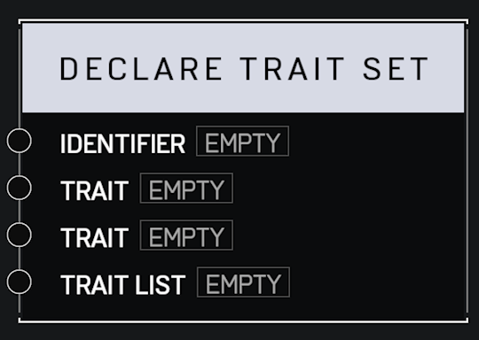

# Declare Trait Set

## Description

Creates a named collection of player **Traits** at global scope as soo as the node graph script runs. Trait Sets cannot be modified after creation. Apply the set to players using nodes like **Apply Trait Set**.

## Arguments

Inputs:

* Monitor Object

Outputs:

* Area Monitor
