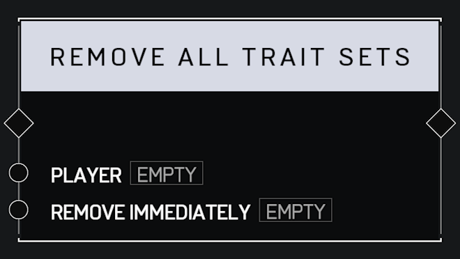

# Remove All Trait Sets

## Description

Removes all **Trait Sets** applied to the _Player_, resetting them to their default state. Optionally _Remove Immediately_ or wait for the next respawn to take effect.

## Arguments

Inputs:

* Monitor Object

Outputs:

* Area Monitor
