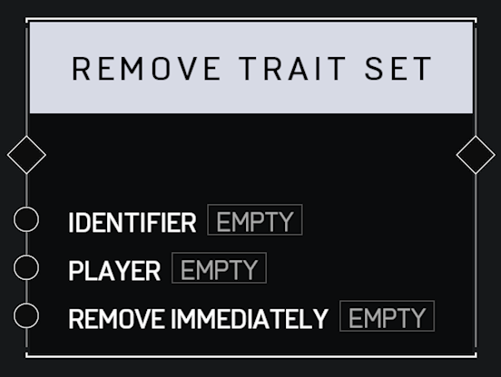

# Remove Trait Set

## Description

Removes the **Trait Set** with the matching _Identifier_ from the _Player_. Optionally _Remove Immediately_ or wait for the next respawn to take effect.

## Arguments

Actions:

* Input
* Output

Inputs:

* Identifier
* Player
* Remove Immediately
