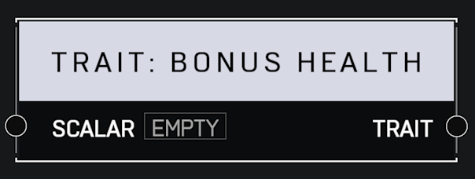

# Trait Bonus Health

## Description

Gives a players bonus health as a percent of their base health. A _Scalar_ of 0.0 is the the default, for a health total of 90. For example, a value of 2 will give the player 180 extra health for a total of 270.

## Arguments

Inputs:

* Scalar

Outputs:

* Trait
