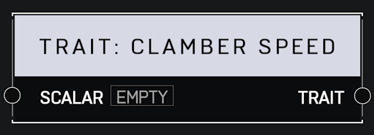

# Trait Clamber Speed

## Description

Affects how quickly a player completes their clamber animation. A _Scalar_ of 1.0 is default. Higher values mean the player clambers faster.

## Arguments

Inputs:

* Scalar

Outputs:

* Trait
