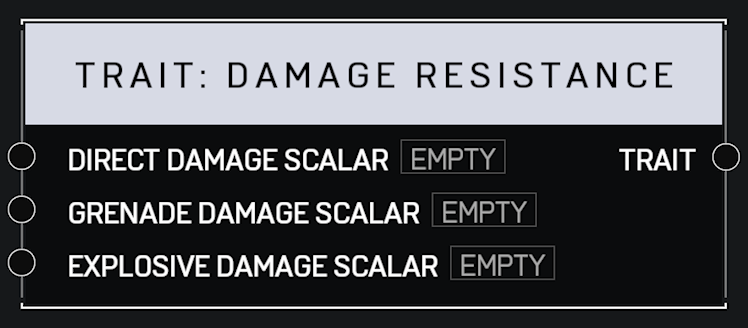

# Trait Damage Resistance

## Description

Affect the amount of damage a player receives from various sources. A _Scalar_ of 1.0 is the default for all pins. Lower values mean the player takes less damage.

## Arguments

Inputs:

* Direct Damage Scalar
* Grenade Damage Scalar
* Explosive Damage Scalar

Outputs:

* Trait
