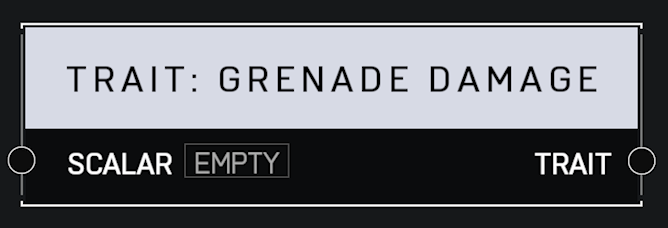

# Trait Grenade Damage

## Description

Affects how much damage a player deals with their grenades. A _Scalar_ of 1.0 is default. Higher values mean the player deals more damage.

## Arguments

Inputs:

* Monitor Object

Outputs:

* Area Monitor
