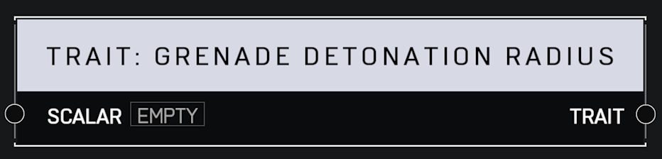

# Trait Grenade Detonation Radius

## Description

Affects the grenade detonation radius of a plyaer's grenades. A _Scalar_ of 1.0 is default. Higher values mean the grenade explosions cover more area.

## Arguments

Inputs:

* Scalar

Outputs:

* Trait
