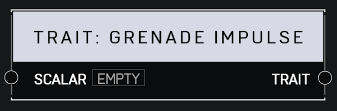

# Trait Grenade Impulse

## Description

Affects how much physics impulse is imparted by a player's grenade explosion. A _Scalar_ of 1.0 is default. Higher values mean grenades push enemies back farther.

## Arguments

Inputs:

* Scalar

Outputs:

* Trait
