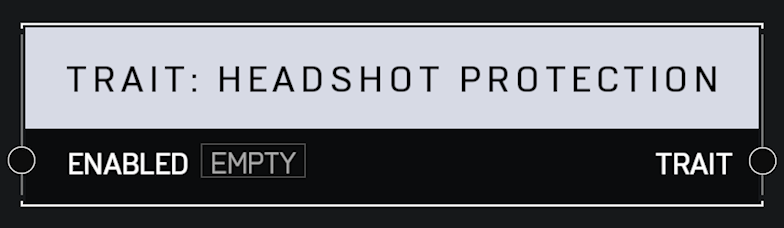

# Trait Headshot Protection

## Description

When enabled, affected players will not take bonus damage from headshots while unshielded.

## Arguments

Inputs:

* Monitor Object

Outputs:

* Area Monitor
