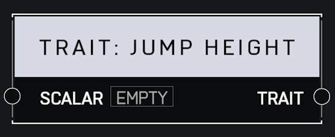

# Trait Jump Height

## Description

Affects a player's base jump height. A _Scalar_ of 1.0 is default. Higher values mean the player jumps higher. This trait does not affect player gravity.

## Arguments

Inputs:

* Scalar

Outputs:

* Trait
