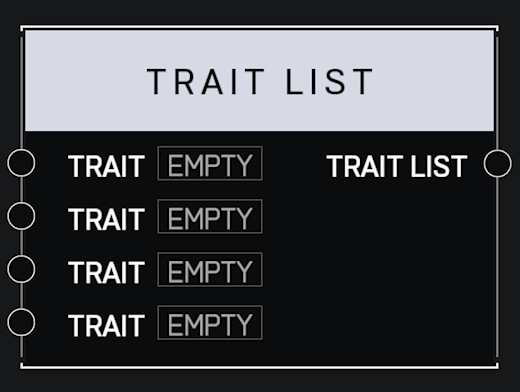

# Trait List

## Description

Stores a list of player **Traits**. Traits in list are ordered and unique, meaning adding a duplicate trait will have no effect.

## Arguments

Inputs:

* Trait
* Trait
* Trait
* Trait

Outputs:

* Trait List
