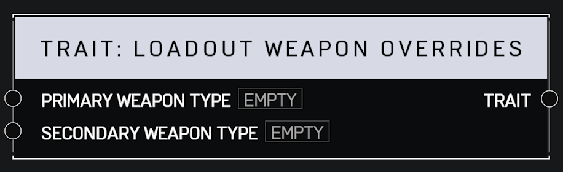

# Trait Loadout Weapon Overrides

## Description

Overides what weapons a player respawns with. Takes effect on the next respawn. Setting to None means no override, meaning the game variant's setting will once again determine the weapon for that slot.

## Arguments

Inputs:

* Monitor Object

Outputs:

* Area Monitor
