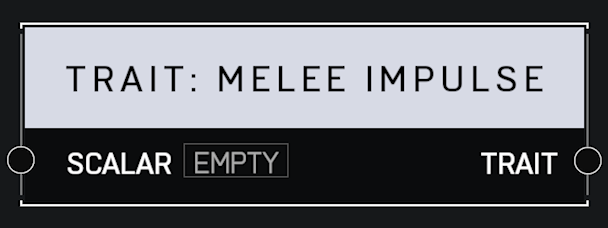

# Trait Melee Impulse

## Description

Affects how much physics impulse is imparted by a player's melee attack. A _Scalar_ of 1.0 is default. Higher values mean melee attacks push enemies back farther.

## Arguments

Inputs:

* Monitor Object

Outputs:

* Area Monitor
