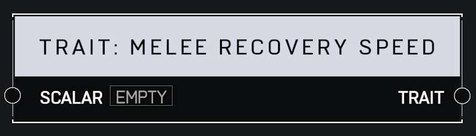

# Trait Melee Recovery Speed

## Description

Affects how fast a player recovers control after performing a melee attack. A _Scalar_ of 1.0 is default. Higher values mean the player can act sooner.

## Arguments

Inputs:

* Monitor Object

Outputs:

* Area Monitor
