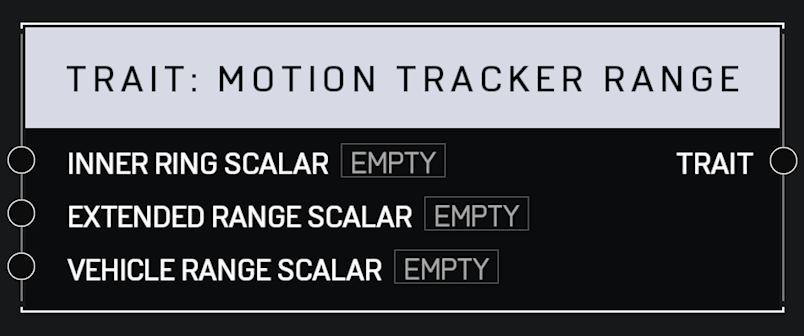

# Trait Motion Tracker Range

## Description

Affects the various ranges of the Motion Tracker. _Scalars_ of 1.0 are the default. Higher values mean the player's Combat Sensor will track targets farther away.

## Arguments

Inputs:

* Monitor Object

Outputs:

* Area Monitor
