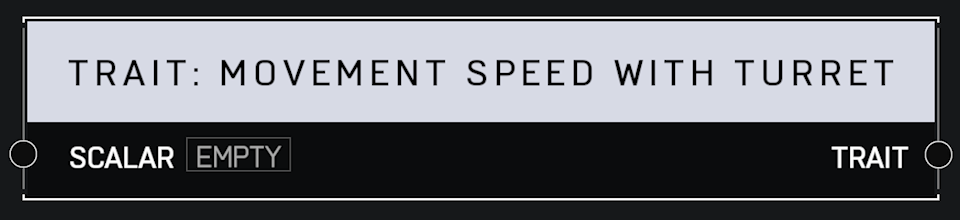

# Trait Movement Speed With Turret

## Description

Affects how fast a player moves. A _Scalar_ of 1.0 is default. Higher values mean the player moves faster.

## Arguments

Inputs:

* Scalar

Outputs:

* Trait
