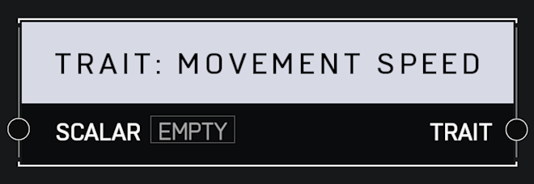

# Trait Movement Speed

## Description

Affects how fast a player moves when holding a heavy object like a detached machine gun turret. A _Scalar_ of 1.0 is default. Higher values mean the player moves faster.

## Arguments

Inputs:

* Scalar

Outputs:

* Trait
