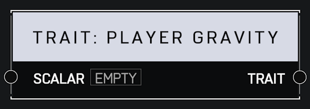

# Trait Player Gravity

## Description

Affects how much gravit affects a player, which changes jump height and fall speed. A _Scalar_ of 1.0 is default. Higher values mean the player jumps lower and falls faster.

## Arguments

Inputs:

* Monitor Object

Outputs:

* Area Monitor
