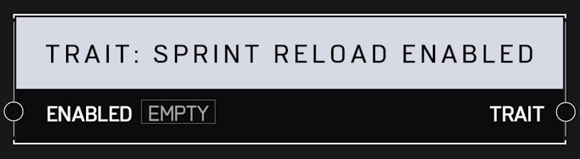

# Trait Sprint Reload Enabled

## Description

When disabled, affected players cannot reload their weapon and sprint at the same time.

## Arguments

Inputs:

* Monitor Object

Outputs:

* Area Monitor
