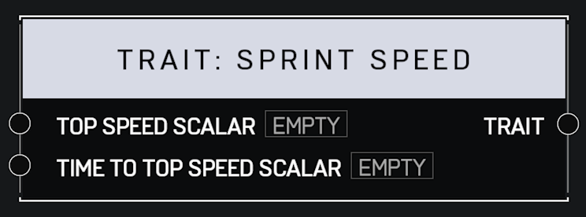

# Trait Sprint Speed

## Description

Affects how fast a player runs at full speed while sprinting and how long it takes for a player to reach full speed after they begin sprinting. A _Scalar_ of 1.0 is default for both pins.

## Arguments

Inputs:

* Top Speed Scalar
* Time To Top Speed Scalar

Outputs:

* Trait
