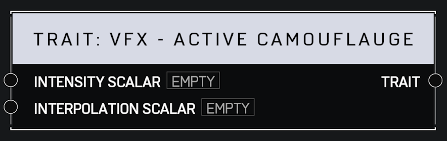

# Trait VFX Active Camouflage

## Description

Sets the intensity of the Active Camouflage visual effect on the player. An _Intensity Scalar_ of 0 leaves the player fully visible while a value of 1 applies perfect camo. _Interpolation Scalar_ controls how fast the player fades.

## Arguments

Inputs:

* Intensity Scalar
* Interpolation Scalar

Outputs:

* Trait
