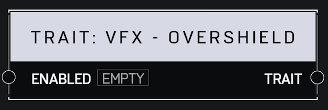

# Trait VFX Overshield

## Description

When enabled, the player will display the Overshield visual effect. This will not actually apply boosted shields - only the visual effect.

## Arguments

Inputs:

* Monitor Object

Outputs:

* Area Monitor
