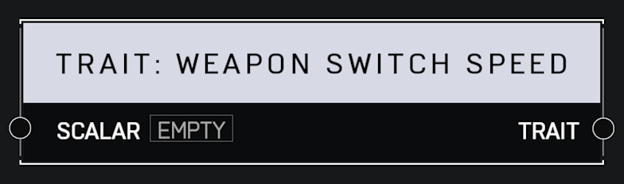

# Trait Weapon Switch Speed

## Description

Affects how fast a player switches weapons. A _Scalar_ of 1.0 is default. Higher values mean the player switches weapons faster.

## Arguments

Inputs:

* Monitor Object

Outputs:

* Area Monitor
