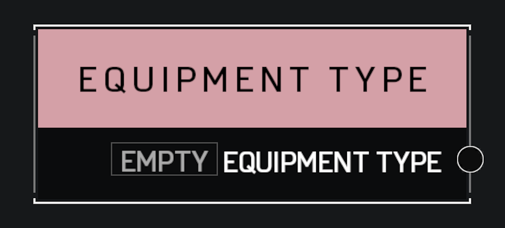

# Equipment Type

## Description

Stores an **Equipment Type** value such as Grappleshot or Active Camo. If you want to store a reference to a specific equipment instance, use an **Object Reference** variable instead.

## Arguments

Outputs:

* Equipment Type
