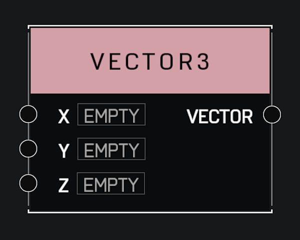

# Vector3

## Description

Stores a **Vector** of 3 numbers. Can be used to represent positions, rotations, and more. Use **Get Vector Axis Value** to access the individual elements within an existing vector.

## Arguments

Inputs:

- X
- Y
- Z

Outputs:

- Vector
