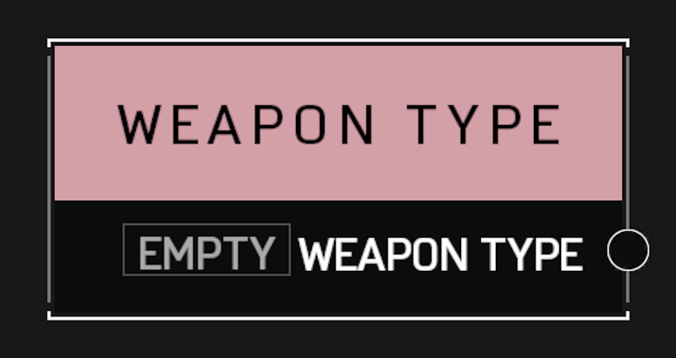

# Weapon Type

## Description

Stores a **Weapon Type**, such as Rocket Launcher. If you want to store a reference to a specific weapon instance, use an **Object Reference** variable instead.

## Arguments

Outputs:

* Weapon Type
