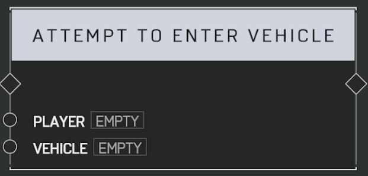

# Attempt To Enter Vehicle

## Description

Have the _Player_ attempt to enter the _Vehicle_ regardless of distance. Will not succeed if the _Vehicle_ has no seats available or the _Player_ is already in a vehicle.

## Arguments

Inputs:

- Player
- Vehicle
