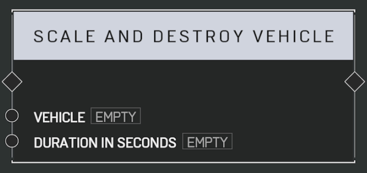

# Scale And Destroy Vehicle

## Description

Fades the _Vehicle_ out over the specified duration and then destroys it, like a Phantom in campaign.

## Arguments

Inputs:

- Vehicle
- Duration In Seconds
