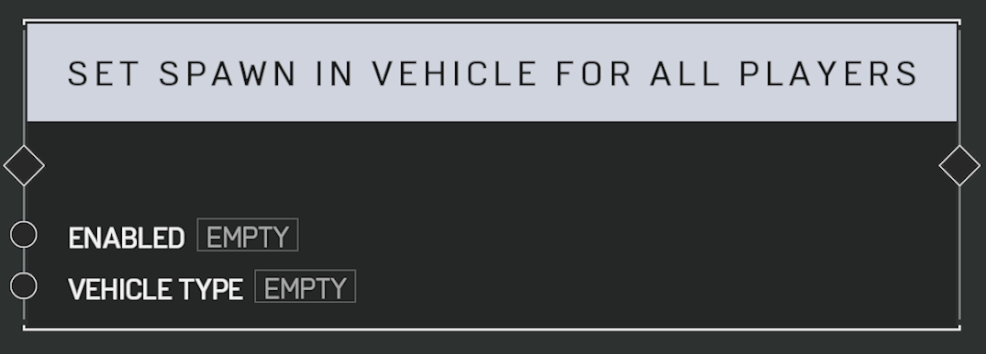

# Set Spawn In Vehicle For All Players

## Description

Enables or disables whether all players respawns in a specific  type of vehicle instead of on foot.

Use with care. Too many vehicles on the map can severely affect network performance.

## Arguments

Inputs:

- Enabled
- Vehicle Type
