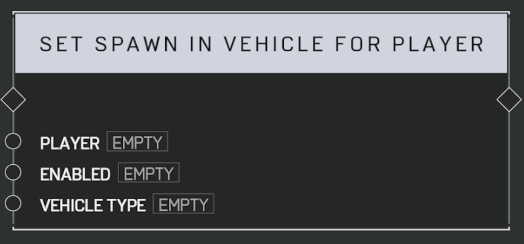

# Set Spawn In Vehicle For Player

## Description

Enables or disables whether a _Player_ respawns in a specific  type of vehicle instead of on foot.

Use with care. Too many vehicles on the map can severely affect network performance.

## Arguments

Inputs:

- Player
- Enabled
- Vehicle Type
