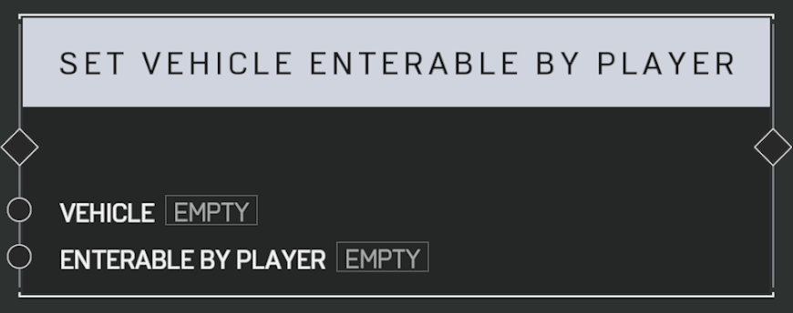

# Set Vehicle Enterable By Player

## Description

When _Enterable By Player_ is set to false, all players will be prevented from entering the _Vehicle_. To prevent a specific player from driving or gunning, consider using a **Trait: Vehicle Passenger Only**.

## Arguments

Inputs:

- Vehicle
- Enterable By Player
