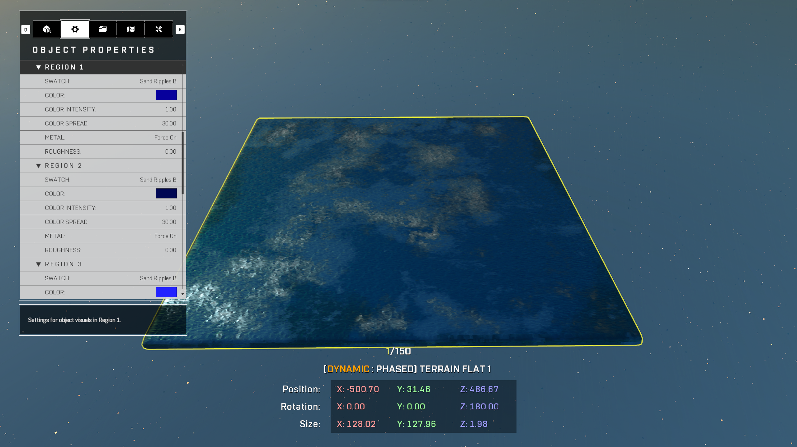

# Create False Water

## Description

Create false water, by using reflection volumes and modifying primitive object materials.

## Required Objects

* [Reflection Volume](../objects/lights/generic-light-objects/reflection-volume.md)
* [Terrain Flat](../objects/biomes/terrain/terrain-flat.md)
* [FX Forerunner Energy Barrier 48x28](../objects/fx/energy/fx-forerunner-energy-barrier.md)
* [Script Brain](creating-false-water.md)

## Steps

1. Place Terrain Flat piece in desired location
   * Change the Terrain Flat piece from **Static** to **Dynamic**, to allow movement of the object
   * Change the visuals of each region with these settings
     * Swatch: **Sand Ripples B**
     * Metal: **Force On**
     * Roughness: **0.00**
   * Change the color of each region to the desired color
     * _Note: For a better look, each region should be a different color._

2. Place Reflection Volume over the Terrain Flat piece
   * Change the Boundary size of the Reflection Volume. This is necessary to help reflect the lighting off of metal surface objects, in this case the Terrain Flat.
   * _Note: Make sure the volume in covers the entire terrain flat piece or the desired area that is intended for displaying False Water effect._

3. Creating the false movement of water, the need to move the Terrain Flat piece is essential in creating the look of moving water.
   1. Select the Terrain Flat object and then open Node Graph
      * Press '**Y**' and select '**Add Object Reference**
   2. After the Object Reference node has been placed, add these nodes to help simulate movement of the Terrain Flat object.
      * [Get Object Position](../scripting/objects-transform/get-object-position.md)) (Objects Transform/Get Object Position)
      * [Vector3](../scripting/variables-basic/vector3.md) (Variables Basic/Vector3)
      * [Add Vectors](../scripting/math/add-vectors.md) (Math/Add Vectors)
      * [Every N Seconds](../scripting/events-events-custom/every-n-seconds.md) (Events Custom/Every N Seconds)
      * [Translate Object To Point](../scripting/objects-transform/translate-object-to-point.md) (Objects Transform/Translate Object To Point)
   3. See reference image to help create a movement effect of the Terrain Flat


Create your script brain in a similar fashion in order to help move the object in three different directions. To change the speed or the distance of the Terrain Flat object, make minor adjustments to the 'Vector3', 'Every N Seconds', 'Translate Object To Point' nodes.


4. Place FX Forerunner Energy Barrier just above the Terrain Flat object
   * Change the FX Color 1 and FX Color 2 to the desired colors

5. Duplicate the FX Forerunner Energy Barrier until the covered area is complete.

## Reference

See the reference video by Paimon on the completed look!


False Water Tutorial - Paimon


