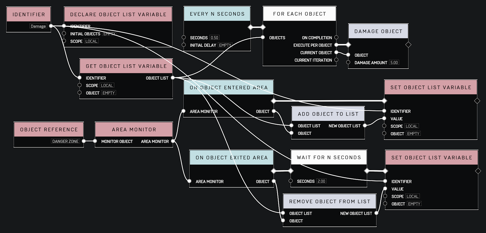
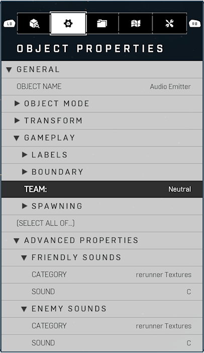
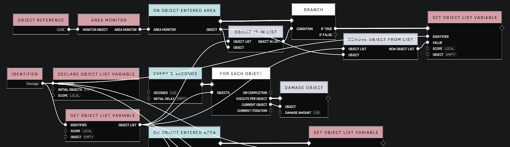
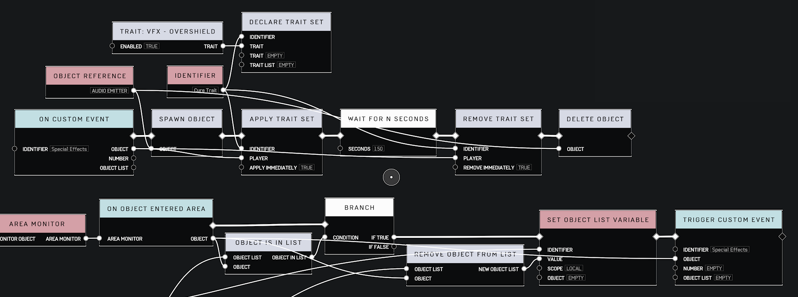
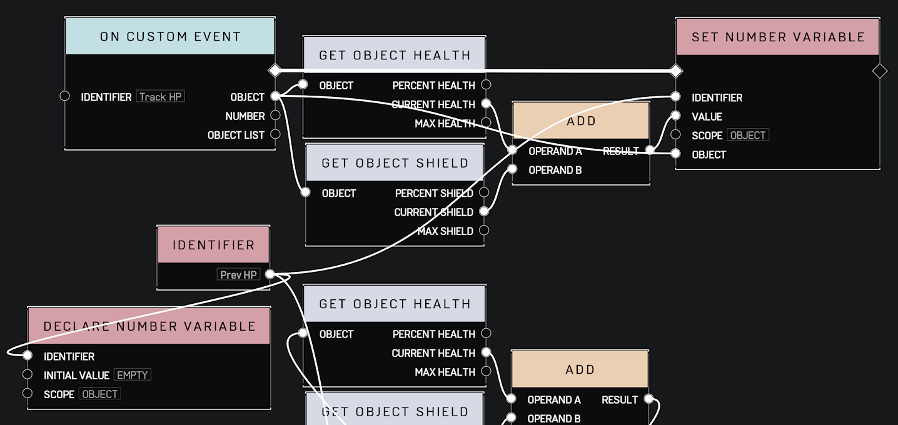
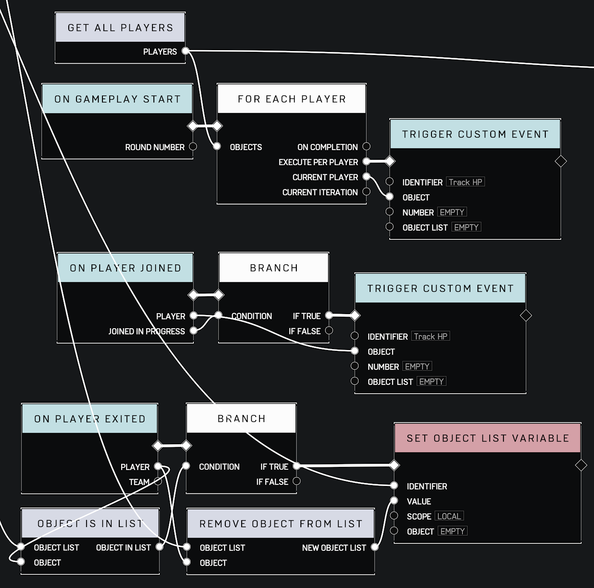
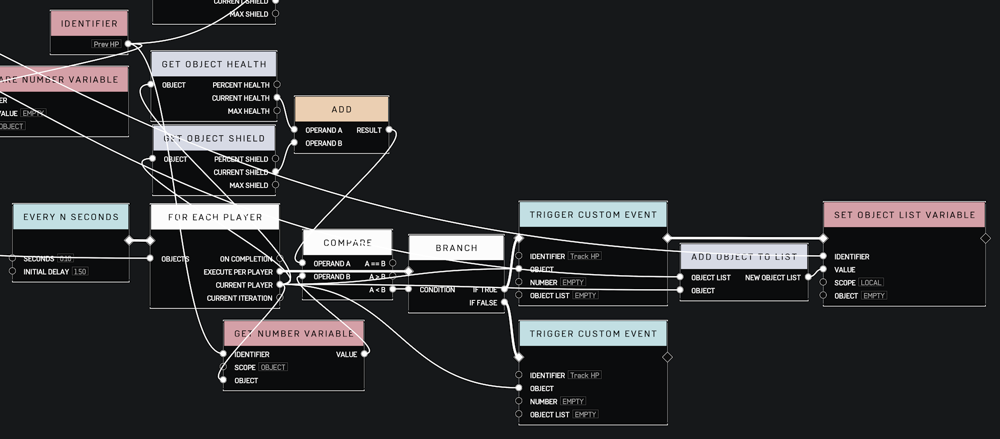
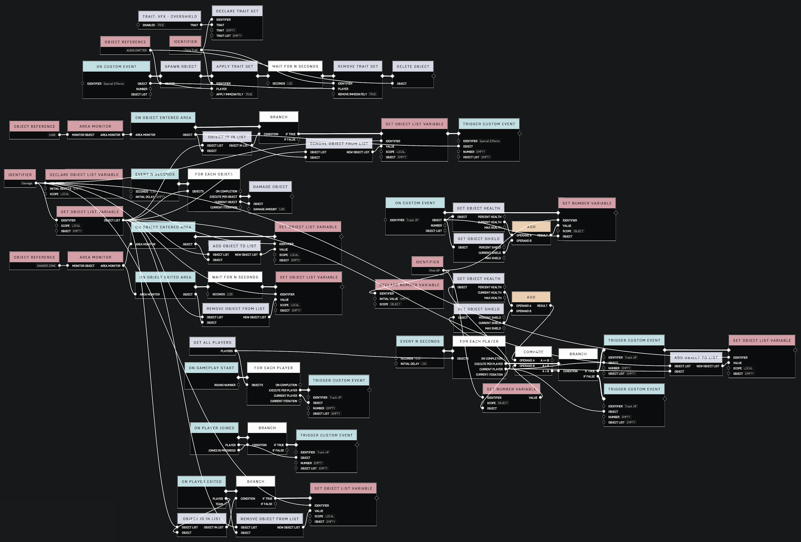

# Damage Over Time

## Description

Create prograssively more complex damage over time (DoT) scripts. The following are themed after a poison effect commonly found in RPGs.

## Required Objects

* [Script Brain](../objects/gameplay/scripting/script-brain.md)
* [Named Location Volume](../objects/gameplay/volumes/named-location-volume.md)
* [Audio Emitter](../objects/gameplay/audio/audio-emitter.md)


A _Named Location Volume_ is used in this tutorial for simplicity but any object can be used if its _Object Mode_ can be set to _Dynamic_ and given a _Gameplay Boundary_.


## Part 1: The Danger Zone

### The Goal {#part-1-goal}

The simplest DoT effect we can make is going to be a zone that deals damage to anything inside its boundaries. A common use case for this is a "the floor is lava" scenario.

We're going to accomplish this in the following manner:

1. Define the boundaries of the zone.
2. Deal damage to each object in the zone.


Players are registered as entering or exiting a boundary based on their midsection. If the bottom of a boundary is aligned with the ground, then the distance to the top will need to be at least 3.6 units to register a standing and 2.5 units for a crouching Spartan.


### Required Nodes {#part-1-requirements}

* x1 - [Every N Seconds](../scripting/events-custom/every-n-seconds.md)
* x1 - [For Each Object](../scripting/logic/for-each-object.md)
* x1 - [Damage Object](../scripting/objects/damage-object.md)
* x1 - [Get Objects In Area Monitor](../scripting/objects/get-objects-in-area-monitor.md)
* x1 - [Area Monitor](../scripting/variables-basic/area-monitor.md)
* x1 - [Object Reference](../scripting/variables-basic/object-reference.md)


The _For Each Object_ node is effectively interchangable with the _For Each Player_ node. The only difference between the two is that the player version will ignore all non-player objects in the supplied list. The object version is required to **also** damage any other objects that have health, e.g. vehicles and destructibles.


### Steps {#part-1-steps}

#### Add Objects {#part-1-objects}

Add a _Script Brain_ anywhere to the map. These are located under Gameplay 🡒 Scripting.

Add a _Named Location Volume_ and adjust its position and boundary to fit your needs. These are located under Gameplay 🡒 Volumes.

Give this volume a name. _Danger Zone_ will be used for the duration of this tutorial.


Naming objects for scripting is optional. However, names you provide will likely be more effective than the default.


#### Select References {#part-1-references}

Select the _Script Brain_ and _Danger Zone_ and enter the node graph.


Selecting the _Script Brain_ before entering a node graph will guarantee you enter the brain you intend to edit. Forge will remember which brain you were in last.


#### Add Nodes {#part-1-nodes}

Once inside the node graph, pressing Y will bring up a secondary menu with the option _Add Object Reference_ and populate an _Object Reference_ node for each _Dynamic_ object that was selected. You will need to delete the _Script Brain_ reference if you had it selected as we will not be using it.

The remaining required nodes are located under:

* Events Custom
* Logic
* Objects
* Variables Basic

#### Configure Nodes {#part-1-config}

Configuring the nodes is fairly straightforward. The 2 pins you should note are the _Seconds_ and _Damage Amount_ on the _Every N Seconds_ and _Damage Object_ nodes respectively. This should be fairly obvious, but they will determine the rate and amount of damage.


The _Every N Seconds_ node provides us with a technique called polling. It will ensure that all connected nodes are executed at a regular interval.


### Result {part-1-result}

## Part 2: Lingering Damage

### The Goal {#part-2-goal}

Expanding upon the last script, what we want to do now is have a brief period of time when damage continues if a player leaves the _Danger Zone_ as if they have been poisoned. To accomplish this, we will need to record a list of players that have entered the _Danger Zone_ and start a timer when they exit to remove them from this list.

### Required Nodes {#part-2-requirements}


The following nodes are only the new nodes that we'll be using.


* x1 - [On Object Entered Area](../scripting/events/on-object-entered-area.md)
* x1 - [On Object Exited Area](../scripting/events/identifier.md)
* x1 - [Wait For N Seconds](../scripting/logic/wait-for-n-seconds.md)
* x1 - [Add Object To List](../scripting/objects/add-object-to-list.md)
* x1 - [Remove Object from List](../scripting/objects/remove-object-from-list.md)
* x1 - [Delcare Object List Variable](../scripting/variables-advanced/declare-object-list-variable.md)
* x1 - [Get Object List Variable](../scripting/variables-advanced/get-object-list-variable.md)
* x2 - [Set Object List Variable](../scripting/variables-advanced/set-object-list-variable.md)
* x1 - [Identifier](../scripting/variables-basic/identifier.md)


The _Identifier_ node is optional, but it will make the configuring of the nodes simpler and save time as you will only have to connect pins instead of typing the name you want to use into every other node.


### Steps {#part-2-steps}

#### Add Objects {#part-2-objects}

If you've followed along from the last part, there are no new objects to add. See [part 1 objects](#part-1-objects) for the already existing objects.

#### Select References {#part-2-references}

There are no new references, so see [part 1 references](#part-1-references) for the already existing references.

#### Add Nodes {#part-2-nodes}

We won't need the _Get Objects In Area Monitor_ node anymore, so it can be deleted. The new required nodes are located under:

* Events
* Logic
* Objects
* Variables Advanced
* Variables Basic

In order to replicate what the _Get Objects In Area Monitor_ node was doing for us before, we're going to use the _Declare Object List Variable_ that will record what objects have entered and exited the _Danger Zone_. Due to the nature of scripting, you can safely assume that when you get or set declared variables, they will be up to date when the node runs.


There are 3 types of variable scope:

1. Most of the time, _Local_ will be good enough for anything you need to script as it will keep your variable accessible only to the brain it's declared in. You could technically reuse the name for separate variables in other brains.
2. _Global_ simply allows the declared variable to be accessible from any brain. That is, you won't have separate variables in different brains if the same name is used.
3. We'll use _Object_ in [part 4](#part-4-nodes).



#### Configure Nodes {#part-2-config}

The biggest change to the [part 1 config](#part-1-config) is we will have 2 main sections to the script. The top is our poll from part 1 that will deal the damage to everything in the declared list at a regular interval. The bottom will manage what objects are in the declared list.

2 _Set Object List Variable_ nodes are required due to the restriction that nodes with diamond pins may only be connected to a single event node. Everything else is fairly straightforward. Note the _Seconds_ pin in the _Wait For N Seconds_ node. This will determine how long you want the poison effect to last after the object leaves the _Danger Zone_.


Important note: At the time of this writing, there is no way to terminate the execution of a script path if a given condition is met.

For this simple implementation, you will notice a slight bug. If you reenter the _Danger Zone_ before the _On Object Exited Area_ path completes the _Wait For N Seconds_ node, you will no longer take damage while inside the _Danger Zone_.

There are a couple of simple fixes for this, one of which is using the same _Wait For N Seconds_ duration on the _On Object Entered Area_ path.


### Result {#part-2-result}

## Part 3: Curing The Effect

### The Goal {#part-3-goal}

In the last part, we separated the cause of the poison effect from the management of those affected by it. We'll take advantage of this in the next part, but for now we have another thing to take care of. Fitting to the theme of a poison effect in an RPG, we're now going to add a condition to immediately cure the poison.

In order to keep this as simple as possible, this cure will be setup in the same way we made the poison. In fact, we've already scripted the means of achieving this effect. We're also going to introduce some additional, but entirely optional, nodes that are useful when making any script.

### Required Nodes {#part-3-requirements}


The following nodes are only the new nodes that we'll be using.


* x1 - [On Custom Event](../scripting/events-custom/on-custom-event.md)
* x1 - [Trigger Custom Event](../scripting/events-custom/trigger-custom-event.md)
* x1 - [Branch](../scripting/logic/branch.md)
* x1 - [Delete Object](../scripting/objects/delete-object.md)
* x1 - [Object Is In List](../scripting/objects/object-is-in-list.md)
* x1 - [Spawn Object](../scripting/objects/spawn-object.md)
* x1 - [Apply Trait Set](../scripting/traits/apply-trait-set.md)
* x1 - [Declare Trait Set](../scripting/traits/delcare-trait-set.md)
* x1 - [Remove Trait Set](../scripting/traits/remove-trait-set.md)
* x1 - [Trait: VFX - Overshield](../scripting/traits/trait-vfx-overshield.md)

### Steps {#part-3-steps}

#### Add Objects {#part-3-objects}

Just like in the [part 1 objects](#part-1-objects) section, we're going add a _Named Location Volume_, give it its own name (Cure for this tutorial), and adjust its position and boundary according to our needs.

Optionally, we can add an _Audio Emitter_ that will play a sound to indicate that the player has been cured of the poison. Forerunner Textures C is used for this tutorial. These are located under Gameplay -> Audio.


In edit mode, objects are spawned from the menu on a neutral team. This is fine for the purposes of this sound and you will need to assign at least the _Enemy Sounds_ option to hear it in play mode. To test a _Friendly Sounds_ option, you will have to switch teams in the start menu.


#### Select References {#part-3-references}

We will need the _Cure_ and _Audio Emitter_ as new references.

#### Add Nodes {#part-3-nodes}

See [part 1 nodes](#part-1-nodes) for auto populating _Object References_ with the selected references.

As stated earlier, we've already used all of the nodes necessary for applying the cure. They can be found in the _On Object Exited Area_ part of the script from the [part 2 config](#part-2-config), but we want the _On Object Entered Area_ event because we're curing.

Duplicate these nodes and feed in an _Area Monitor_ line from the _Cure_ reference to complete the minimum effect.

The new required nodes are located under:

* Events Custom
* Logic
* Objects
* Traits

The optional nodes we're going to add are going to be useful for any other scripts you make. Primarily they are:

* Branch - this takes a condition and will continue execution through 1 of 2 paths of pins. Although they don't look it, the true and false pins can only connect to other diamond pins.
* Custom events - these come in pairs: a "trigger" node and "on" node. These act like function calls and can allow you to better organize the graph.
* Spawn and Delete objects - these are self explanatory.
* Traits - these are important for modifying the traits of players at any given moment and are key to making unique game mechanics.

#### Configure Nodes {#part-3-config}

The minimum configuration is as follows:

The branch is optional, but demonstrates a simple and useful technique.

Because the graph is getting to be long we're going to move the optional stuff into their own event with the _On Custom Event_ node and call it with the _Trigger Custom Event_ node. The _Trigger Custom Event_ node will pass arguments (an object, number, and/or object list) to the _On Custom Event_ node it's triggering.


At the time of this writing, you will need to manually type the name of the _Identifier_ into these 2 nodes in order for them to work. If you use an _Identifier_ node, the _Global Log_ will show an error without an explanation.


In order to let the player and anyone watching them know they've been cured, we're going to play a sound and give them the VFX of the overshield for the duration of the curing effect.

In order to work with the _Audio Emitter_, we will need to spawn and delete it to properly play and stop its audio. For the VFX, we will need to put the _Trait: VFX - Overshield_ node into a _Declare Trait Set_, _Apply Trait Set_ to the player passed into the _On Custom Event_, and finally _Remove Trait Set_ when we want the effect to end.

### Result {#part-3-result}


This result is presented as a GIF and therefore lacks any sound.


## Part 4: Poison Guns

### The Goal {#part-4-goal}

For this final part, we're going to add nodes that will add an additional mechanic to whatever game mode this script is played with. Since we've established a list of objects that will be damaged over time if they've recently entered the _Danger Zone_, we're going to add another way to add objects to this list: when they take damage.

### Required Nodes {#part-4-requirements}


The following nodes are only the new nodes that we'll be using.


* x1 - [Get All Players](../scripting/players/get-all-players.md)
* x1 - [On Gameplay Start](../scripting/events/on-gameplay-start.md)
* x1 - [On Player Joined](../scripting/events-players/on-player-joined.md)
* x1 - [On Player Exited](../scripting/events-players/on-player-exited.md)
* x2 - [Get Object Health](../scripting/objects/get-object-health.md)
* x2 - [Get Object Shield](../scripting/objects/get-object-shield.md)
* x2 - [Add](../scripting/math/add.md)
* x1 - [Declare Number Variable](../scripting/variables-advanced/declare-number-variable.md)
* x1 - [Get Number Variable](../scripting/variables-advanced/get-number-variable.md)
* x1 - [Set Number Variable](../scripting/variables-advanced/set-number-variable.md)
* x1 - [Compare](../scripting/logic/compare.md)

### Steps {#part-4-steps}

#### Add Objects {#part-4-objects}

If you've followed along from the last part, there are no new objects to add. See [part 2 objects](#part-2-objects) for the already existing objects.

#### Select References {#part-4-references}

There are no new references, so see [part 2 references](#part-2-references) for the already existing references.

#### Add Nodes {#part-4-nodes}

In order to track if a player has taken damage, we're going to attach a variable to them. This _Declare Number Variable_ will use the _Object_ scope level to create an instance of the variable for each player that will be unique to them. You can think of this scope as a hybrid of _Local_ and _Global_ since you need to use an object to access it, but it can be accessed in any brain that gets that object. It's also going to be useful to set the value of this variable in its own custom event that will be called at various times. We'll call it _Prev HP_.

Next, we're going to add some housekeeping with the gamemode and our new number variable.

1. To ensure every player has this variable on them and is properly reset at the start of each round, the _On Gameplay Start_ event will _Trigger Custom Event_ that sets the value of the variable.
2. The _On Player Joined_ event provides a boolean for if a player _Joined In Progress_ and will also give this player our variable.
3. The _On Player Exited_ event can be used to remove the leaving player from the _Damage_ object list.


It may not be necessary to remove the player from the _Damage_ object list as the game may take care of this for you. This is provided for completeness.


Finally, we're going to implement the poison guns effect. We're going to poll each player as soon as the _Every N Seconds_ node will allow us and check if their current health and shields are below their _Prev HP_. If they are, update _Prev HP_ and add them to the _Damage_ list and if not, only update _Prev HP_.


You should notice that this implementation doesn't take into consideration how the player received the damage. It will apply to any source of damage the player receives if there's no other checks in place. Friendly fire, environmental damage, vehicle collision, and anything else will trigger this.


#### Configure Nodes {#part-4-config}


The 3 pins comming from off screen are from the _Damage_ list's _Identifier_ and _Get Object List_ nodes.

The _Get All Players_ node's _Players_ pin is going off screen to the poison guns _For Each Player_ node.



The 2 pins comming from off screen are from the _Damage_ list's _Identifier_ and _Get Object List_ nodes.



An _Initial Delay_ of 1.5 seconds was necessary to get the script to run properly. Without it, the script appears to encounter something analogous to a null reference exception and prevents this script path from running.


### Result {#part-4-result}


The terminal used in this demonstration is simply using the _On Object Interacted_ node to apply immediate damage and demonstrate that the poison guns segment works.



This is the final node graph result of the Damage Over Time tutorial.

