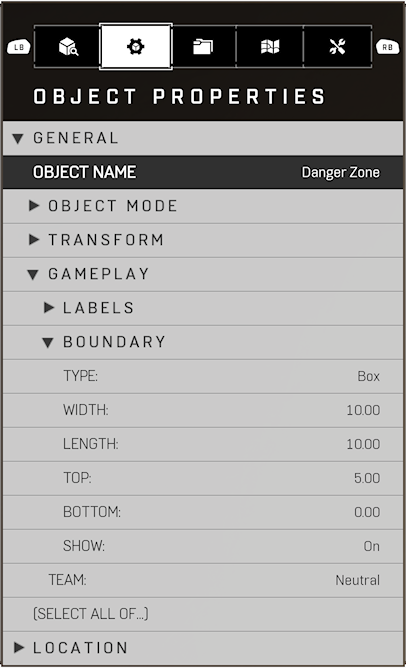
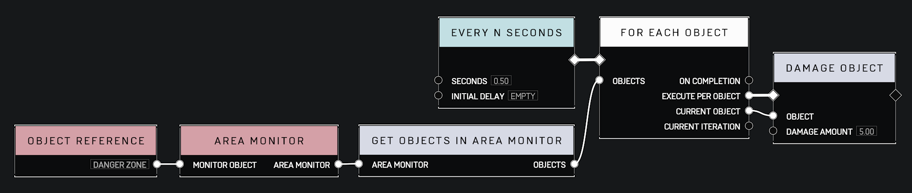

# Damage Over Time

## Description

Create prograssively more complex damage over time (DoT) scripts. The following are themed after a poison effect commonly found in RPGs.

## Required Objects

* [Script Brain](objects\gameplay\scripting\script-brain.md)
* [Named Location Volume](objects\gameplay\volumes\named-location-volume.md)[1](#f1)

## Part 1: The Danger Zone

### The Goal

The simplest DoT effect we can make is going to be a zone that deals damage to anything inside its boundaries. A common use case for this is a "the floor is lava" scenario.

We're going to accomplish this in the following manner:

1. Define the boundaries of the zone.[2](#f2)
2. Deal damage to each object in the zone.

### Required Nodes

* x1 - [Every N Seconds](scripting\events-custom\every-n-seconds.md)
* x1 - [For Each Object](scripting\logic\for-each-object.md)[3](#f3)
* x1 - [Damage Object](scripting\objects\damage-object.md)
* x1 - [Get Objects In Area Monitor](scripting\objects\get-objects-in-area-monitor.md)
* x1 - [Area Monitor](scripting\variables-basic\area-monitor.md)
* x1 - [Object Reference](scripting\variables-basic\object-reference.md)

### Steps

#### Add Objects

Add a _Script Brain_ anywhere to the map. These are located under Gameplay 🡒 Scripting.

Add a _Named Location Volume_ and adjust its position and boundary to fit your needs. These are located under Gameplay 🡒 Volumes.

Give this volume a name[4](#f4). _Danger Zone_ will be used for the duration of this tutorial.

#### Select References

Select the _Script Brain_[5](#f5) and _Danger Zone_ and enter the node graph.

#### Add Nodes

Once inside the node graph, pressing Y will bring up a secondary menu with the option _Add Object Reference_ and populate an _Object Reference_ node for each _Dynamic_ object that was selected. You will need to delete the _Script Brain_ reference if you had it selected as we will not be using it.

The remaining required nodes are located under:

* Events Custom
* Logic
* Objects
* Variables Basic

#### Configure Nodes

Configuring the nodes is fairly straightforward. The 2 pins you should note are the _Seconds_ and _Damage Amount_ on the _Every N Seconds_ and _Damage Object_ nodes respectively. This should be fairly obvious, but they will determine the rate and amount of damage.

### Result

## Part 2: Lingering Damage

### The Goal

description

### Required Nodes

nodes

### Steps

steps

#### Add Objects

objects

#### Select References

references

#### Add Nodes

nodes

#### Configure Nodes

config

### Result

result

## Part 3: Curing The Effect

### The Goal

description

### Required Nodes

nodes

### Steps

steps

#### Add Objects

objects

#### Select References

references

#### Add Nodes

nodes

#### Configure Nodes

config

### Result

result

## Part 4: Poison Guns

### The Goal

description

### Required Nodes

nodes

### Steps

steps

#### Add Objects

objects

#### Select References

references

#### Add Nodes

nodes

#### Configure Nodes

config

### Result

result

## Notes

<b id="f1">1</b> A _Named Location Volume_ is used in this tutorial for simplicity but any object can be used if its _Object Mode_ can be set to _Dynamic_ and given a _Gameplay Boundary_. [↩](#a1)

<b id="f2">2</b> Players are registered as entering or exiting a boundary based on their midsection. If the bottom of a boundary is aligned with the ground, then distance to the top will need to be at least 3.6 units to register a standing and 2.5 units for a crouching Spartan. [↩](#a2)

<b id="f3">3</b> The _For Each Object_ node is effectively interchangable with the _For Each Player_ node. The only difference between the two is that the player version will ignore all non-player objects in the supplied list. The object version is required to **also** damage any other objects that have health, e.g. vehicles and destructibles.

<b id="f4">4</b> Naming objects for scripting is optional. However, names you provide will likely be more effective than the default. [↩](#a4)

<b id="f5">5</b> Selecting the _Script Brain_ before entering a node graph will guarantee you enter the brain you intend to edit. Forge will remember which brain you were in last. [↩](#a5)
