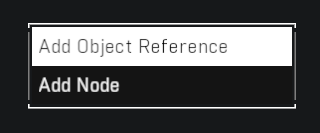
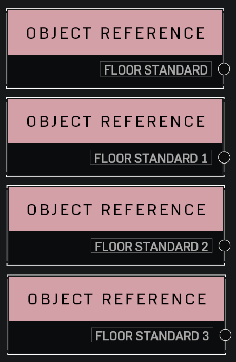
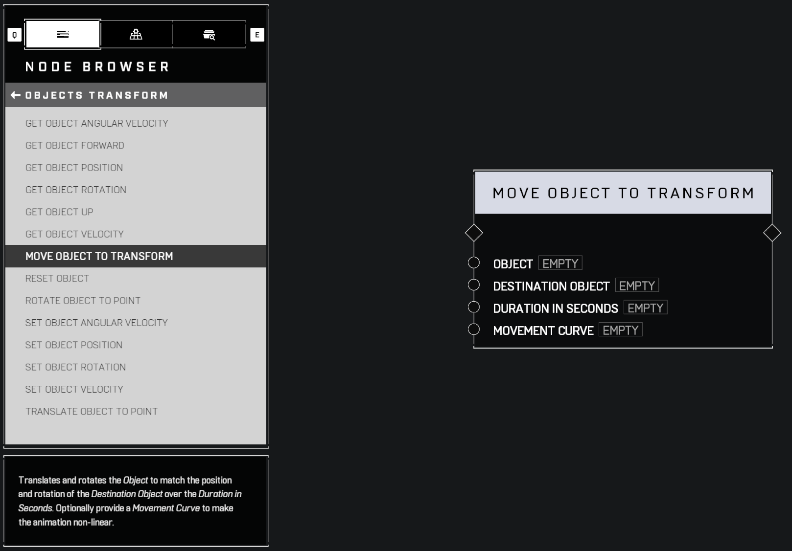
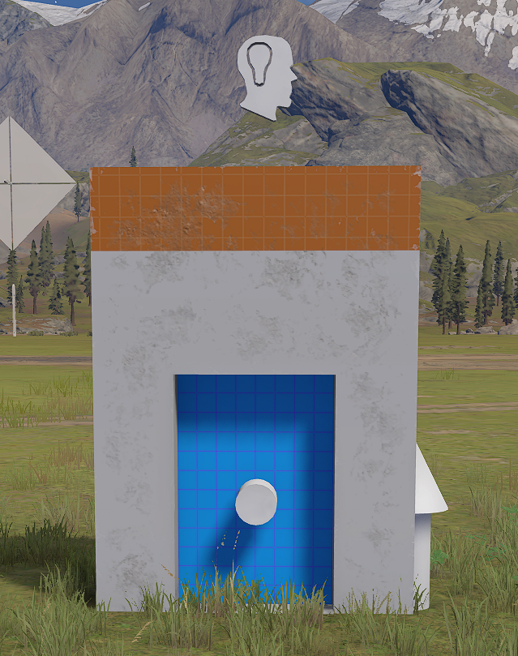
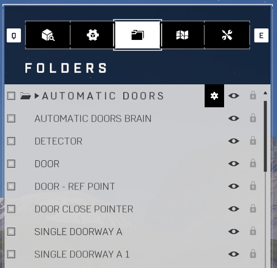
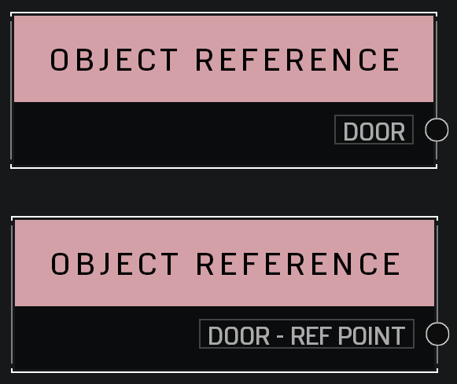
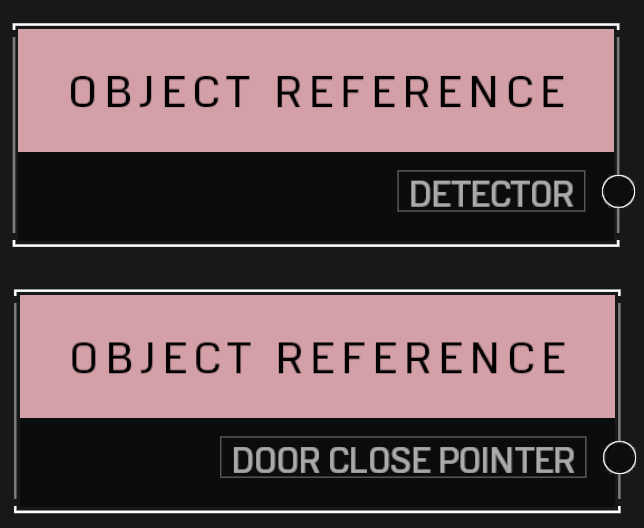
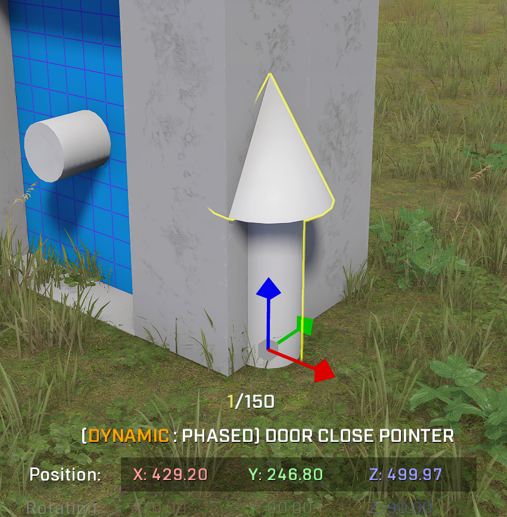
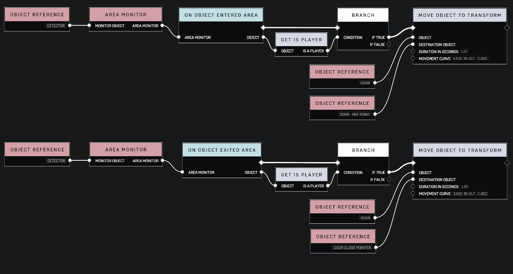

# Scripting Doors

## Description

Create scriptable doors that make your map more interactive.

|||
|:--|:--|
|**Title**| How to Forge Interactive Maps in Halo Infinite |
|**Created By** | [@RedNomster](https://twitter.com/RedNomster)|
|**Reference URL**| https://youtu.be/m3u7XaHU47k|

## Double Doors

### Required Objects

* [Double Doorway](../objects/halo-design-set/doorways/double-doorway.md)
* [Floor Standard](../objects/halo-design-set/floors/floor-standard.md)
* [Script Brain](../objects/gameplay/scripting/script-brain.md)
* [Scriptable Switch (Invisible)](../objects/gameplay/scripting/scriptable-switch-invisible.md)

### Required Nodes

* [Move Object to Transform](../scripting/objects-transform/move-object-to-transform.md)
* [Object Reference](../scripting/variables-basic/object-reference.md)
* [On Object Interacted](../scripting/events-custom/on-object-interacted.md)

### &#x20;Steps

#### Add required objects

Add the required objects to map in order to setup a scripted double doorway.

* 2 - Double Doorway; Stacked back to back
* 4 - Floor Standard; side by side in the middle of the doorway
* 1 - Script Brain
* 1 - Scriptable Switch (Invisible)

#### Object Reference - Switch

Select the Scriptable Switch, then go into Node Graph and place an **Add Object Reference** to the Scriptable Switch.

#### Object Reference - Floors (Doors)

Add Object Reference nodes to each Floor Standard objects, similar to the step above.

#### Add Script Nodes

Add **Move Object to Transform** node and then an **On Object Interacted** node

#### Configure Script Nodes

Connect the nodes; See [reference](scripting-doors.md#reference)


If you prefer to have a faster or slower door movement speed, adjust the amount of seconds on the **Move Object To Transform** node _Duration In Seconds_.


### Result

<figure><figcaption>
Double Doors - Open
</figcaption></figure>

## Automatic Doors

### Required Objects

* [Single Doorway A](../objects/halo-design-set/doorways/single-doorway-a.md)
* [Floor Standard](../objects/halo-design-set/floors/floor-standard.md)
* [Script Brain](../objects/gameplay/scripting/script-brain.md)
* [Pointer](../objects/gameplay/scripting/pointer.md)

### Required Nodes

* [Area Monitor](../scripting/variables-basic/area-monitor.md)
* [Branch](../scripting/logic/branch.md)
* [Move Object to Transform](../scripting/objects-transform/move-object-to-transform.md)
* [Object Reference](../scripting/variables-basic/object-reference.md)
* [On Object Entered Area](../scripting/events/on-object-entered-area.md)
* [On Object Exited Area](../scripting/events/on-object-exited-area.md)

### Steps


_Optional_

Prior to adding objects, create a new folder in order to keep similar objects in the same working folder.


#### Add required objects

Add the required objects to map in order to setup a scripted automatic doorway.

* 2 - Single Doorway A; Stacked back to back
* 2 - Floor Standard; stacked on top of each other, one beneath the surface floor
* 1 - Script Brain
* 2 - Pointer; One pointer used as a boundary another a reference point

#### Object Reference - Floors (Doors)

Add Object Reference nodes to each Floor Standard objects, then go into Node Graph and place an **Add Object Reference** for the doors.

#### Object Reference - Pointers

Select the Detector Pointer, then go into Node Graph and place an **Add Object Reference** to the Pointer.

#### Set Pointer Boundary

Select and place the pointer in the desired placement. Set the boundary that fits the size of where you would like to monitor player movements.

#### Set Reference Pointer

In order to close the door properly, the door must have a Destination Point to reference. Copy the coordinates of the **Closed** door to the same point as the reference pointer, this will ensure the door closes to its original coordinates.

#### Configure Script Nodes

Connect the nodes; See [reference](scripting-doors.md#references)


In order for the script to properly run, you must have the references set correctly. Review the reference video on automatic doors for more information.


### Result

<figure><figcaption>
Automatic Doors - Open and Close
</figcaption></figure>

## References

See the reference video by Red Nomster!


Red Nomster - How to Forge Interactive Maps in Halo Infinite


|||
|:--|:--|
|**Page Authored By**| [@Nitro](https://twitter.com/NitroForged)|
|**Date**|  20 November 2022  |