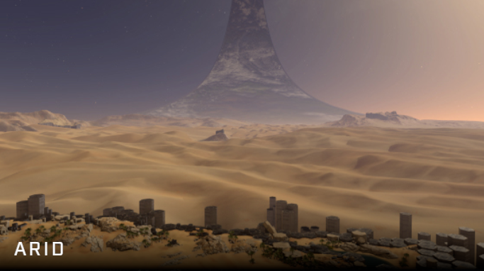
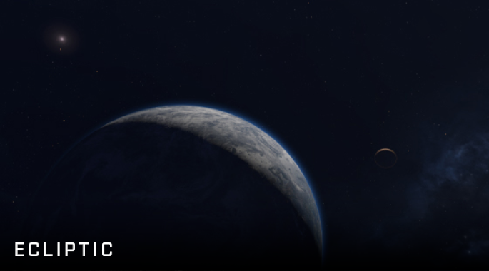
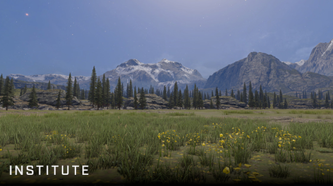
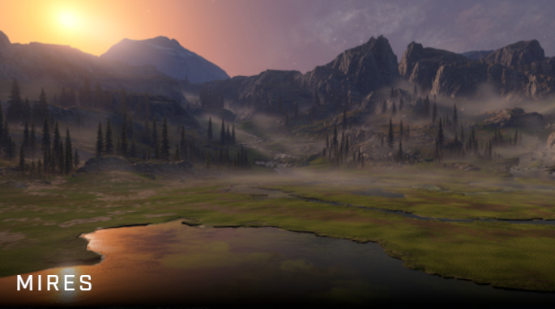
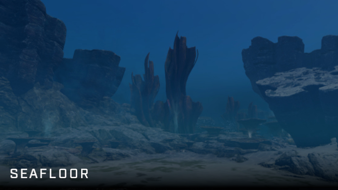
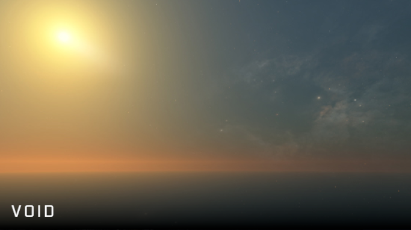

# Forge Canvas

## Description

Where the building process begins, on a canvas.


**Canvas Size**

(Length x Width x Height) in World Units (WU): 400 x 400 x 150



## List of canvases

### Arid

Desert themed, on a Halo ring.

### Ecliptic

Outer space map, no terrain, planets in skybox.

### Institute

UNSC Academy themed, evergreens and mountain scape view.

### Mires

Marsh, wetland environment.

### Seafloor

On the floor of the sea.

### Void

Blank canvas, default objects and skybox only.

