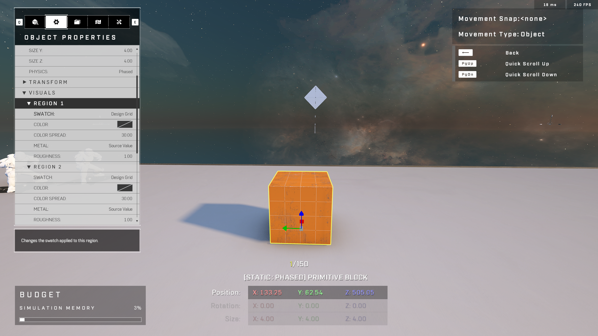
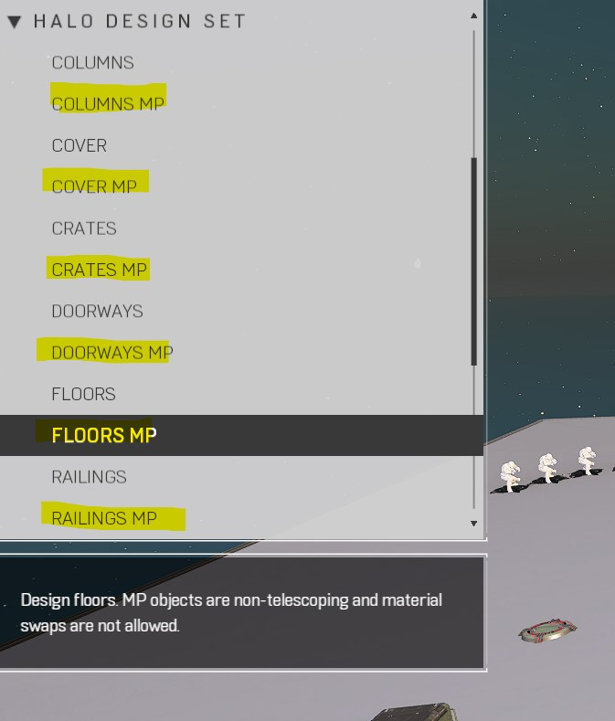
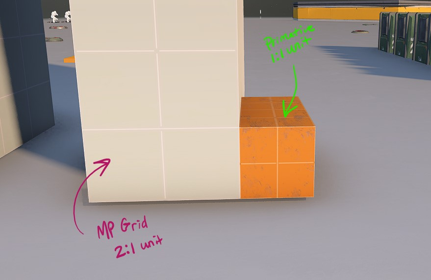
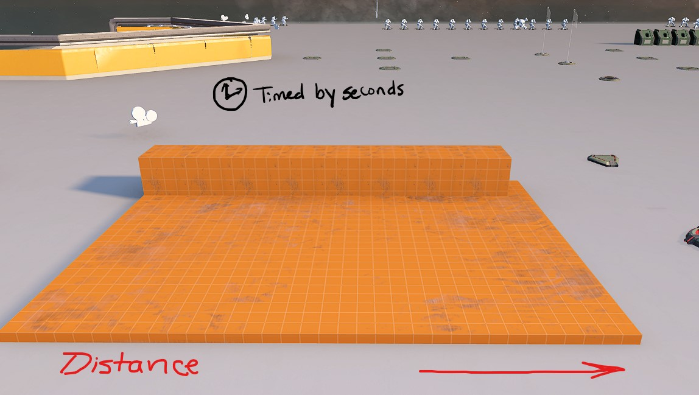
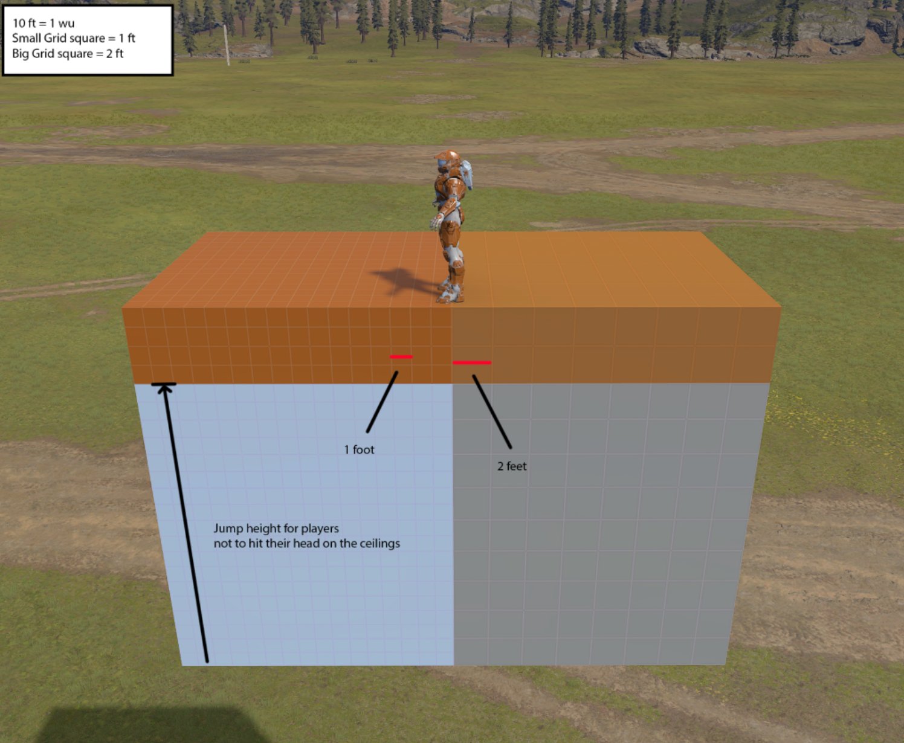

# Forge Map Scale

## Intro

This page references grid sizes to standardize the scale of objects in the forge. Use the Design Grid material with objects in your level design to visually measure within forge while blocking out the level in the early stages of your design. **1 square = 1 ft in forge size measurement. This is also referenced as a grid unit.**

Example Object properties for : **Primitive Block**

<figure><figcaption>
All region swatches set to Design Grid
</figcaption></figure>

<figure><figcaption>
When referencing grid units in this doc, reference the size value in the Forge UI.
</figcaption></figure>

### **MP Grid vs Design grid texture**

**Tip:** You can use MP design objects to get preset objects with a design grid by default. But keep in mind that the grid for those objects are doubled (2:1). Meaning 1 grid square is actually 4x4 units

| MP objects in Object Browser                                                     | Comparison to primitive design grid                                                                 |
| -------------------------------------------------------------------------------- | --------------------------------------------------------------------------------------------------- |
|  |  |

## Player estimated movement velocity


Credit: Aozolai ([youtube](https://www.youtube.com/watch?v=KlkuuNG8g90\&t=35s\&ab\_channel=Aozolai)), pasted measurements below


| Movement type        | Meters per second    |
| -------------------- | -------------------- |
| Base Movement        | 7.6 m/s              |
| Sprint               | 8.6 m/s (13% faster) |
| Slide Slope velocity | \~15 m/s             |

## Player Movement speed by seconds

<figure><figcaption>
Using a consistent system of seconds measured will allow you to design with movement in mind.
</figcaption></figure>

### Measured distance table

**Movement Token**: This guide uses a standardized classification system of movement that can be used when determining how you want players to move in a space. This will help answer how to layout the map for questions like: _"Does the player need to sprint between cover?" "How far should obstacles be between opposing sides?"_

**Grid units traveled**: This is the result distanced measured by design grid units. The number represents # of grid units it took to travel for the indicated time in seconds. Units are rounded up to the nearest unit of 4 to keep easy, memorable units of measurement for designing levels.

**Time:** Grid Units are measured by standard units of seconds to allow for conversion into distance traveled measured by forge design grid

**Why measure this way?** It allows designers to use these measurements as shortcuts to determine arena sizes, hallways, and other common patterns in level design with movement in mind.

| Movement token  | Time  | Grid Units (ft) traveled |
| --------------- | ----- | ------------------------ |
| Base walk       | 1 sec | 24                       |
| Walk (Short)    | 2 sec | 48                       |
| Walk (Medium)   | 4 sec | 96                       |
| Walk (Long)     | 8 sec | 192                      |
| Base Sprint     | 1 sec | 32                       |
| Sprint (Short)  | 2 sec | 64                       |
| Sprint (Medium) | 4 sec | 128                      |
| Sprint (Long)   | 8 sec | 256                      |

## Player Verticality standards

### Vertical Base Units (Z)

| Vertical Grid unit | Notes                                          |
| ------------------ | ---------------------------------------------- |
| 1                  |                                                |
| 2                  |                                                |
| 4                  | Spartan Knee height                            |
| 8                  | Spartan Head height                            |
| 9                  | Max Jump without climb                         |
| 10                 | Min ceiling height (no collision when jumping) |
| 15                 | Max Ledge grab (Climb)                         |
| 16                 | Average Base door clearance                    |
| 22                 | Default MP Wall height                         |

* Keep ground objects <1 to avoid blocking walk movement
* Keep jumping obstacles from 4-9 units in height to allow jumps without climbing ledge

### General guide for walls

<figure><figcaption>
note (foot is referencing the same design grid metric mentioned in other areas in this doc) 
</figcaption></figure>
